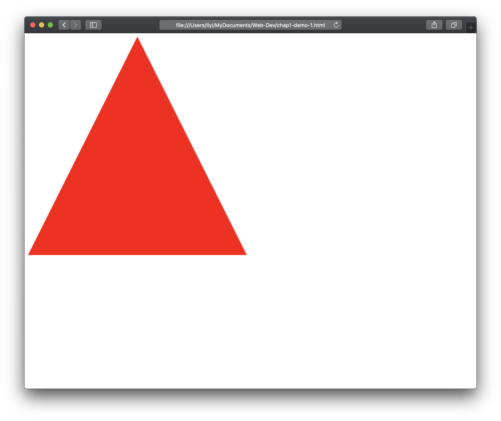
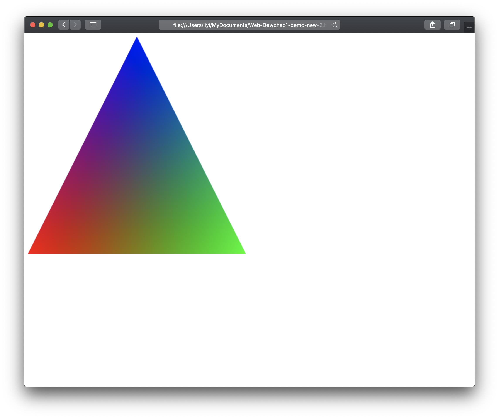

# 实验一 认识WebGL程序

## 1. 实验目的
通过运行第一个WebGL程序，绘制纯色三角形，认识WebGL程序的运行机制，熟悉计算机图形学的基本概念，掌握配置搭建WebGL开发环境的基础知识，并能在此基础上通过修改代码实现对指定图形的显示。

## 2. 实验任务
### 2.1 配置WebGL运行环境

能够正确运行WebGL程序，关键因素有两点：一是你的显卡和驱动，二是你的浏览器。

  * 请检查并确保已安装最新的稳定版的显卡驱动，确保机器能够支持OpenGL。目前的机器无论是独立显卡还是集成显卡，均能提供对OpenGL功能良好的支持
  * 选择一个浏览器，Chrome, Firefox, Safari, Edge均可，注意尽量采用原版
  * 检查你所使用的系统及浏览器是否支持WebGL，访问[http://get.webgl.org](http://get.webgl.org)，如果能够看到一个旋转的立方体，表明你的浏览器能够支持WebGL

### 2.2. 准备开发工具

* 一款趁手的文本编辑器，如VS Code, Sublime Text, Atom, Notepad++, EditPlus等，不建议用集成开发环境，还是认真打字打基础
* 相关工具手册和参考资料，如所需的HTML, JavaScript等的手册，相关JS库的帮助说明等，可查阅[W3CSCHOOL](https://www.w3schools.com/), [WebGL官方网站](https://www.khronos.org/webgl)等
* 一组开发所需的JavaScript库，提供开发WebGL程序运行的支持环境，包括：[webgl-utils.js](https://github.com/KhronosGroup/WebGL/blob/master/sdk/demos/common/webgl-utils.js), 用于提供gl的核心功能函数库，[initShaders.js](https://www.cs.unm.edu/~angel/WebGL/6E/Common/initShaders.js), 由作者提供的对于着色器代码执行输入和解析的封装工具，[MV.js](https://www.cs.unm.edu/~angel/BOOK/INTERACTIVE_COMPUTER_GRAPHICS/SEVENTH_EDITION/CODE/Common/MV.js), 用于提供矩阵计算相关功能的库。我选择的矩阵库是[glMatrix.js](https://www.glmatrix.net)

### 2.3. 绘制三角形
* 首先，确定程序所在目录，建立程序运行所需环境，保证相关js库已能正常装载
* 第二步，建立网页test.html，所有代码见课件
* 第三步，建立绘制所需JavaScript脚本，放在js相关目录下，源代码见课件
* 第四步，在浏览器中打开网页test.html，如果能够看到如下图所示效果，表明所有环境已搭建正常，程序可正常运行。如果不能，请仔细检查
  

### 2.4 修改代码，完成以下任务

不要删除原先的代码，在源代码中将原有代码用注释标明。

以下任务均需自己搜索关于WebGL程序的相关帮助和指南

* 任务a. 修改三角形的显示颜色，比如改成蓝色或绿色
* 任务b. 绘制一个四边形，颜色可任意设置为除红色之外的颜色
* 任务c. 同时绘制一个三角形和一个四边形，将两者设置为相同的颜色，要求同上
* 任务d. 将任务c中的三角形和四边形设置为不同的颜色
* 任务e[^1]. 绘制如下图所示效果的三角形，三角形大小可变，颜色按照示例
  
[^1]: 该任务为选做项

## 3. 实验提交

实验完成后，在自己的个人网站建立链接页面，展示实验一，同时将实验一的所有代码按照实验要求压缩成.zip后上传至课程网站上实验1对应目录下