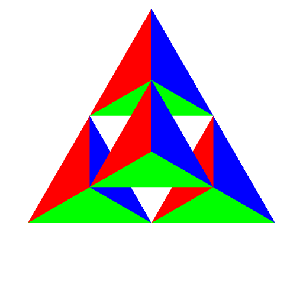
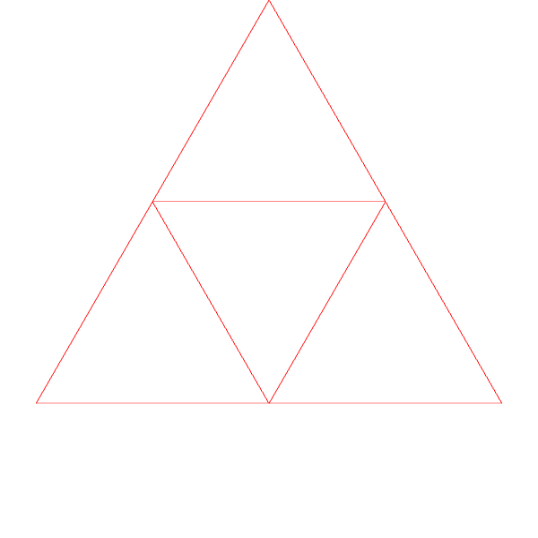
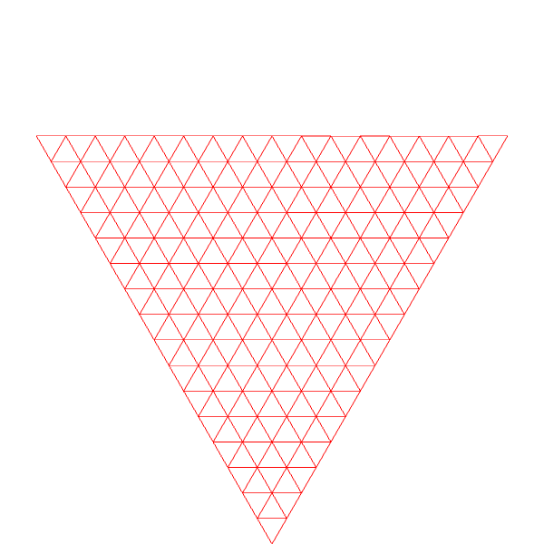
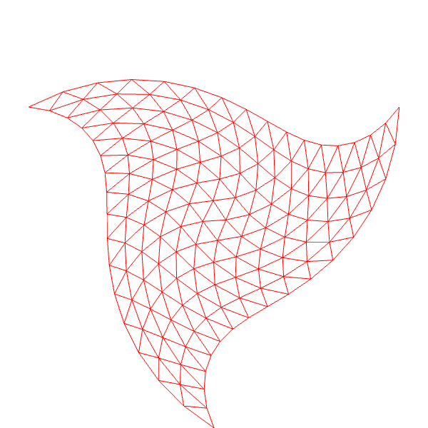

# 实验二 WebGL图案绘制

## 1. 实验目的

熟悉WebGL编程环境，了解WebGL程序绘制过程和绘制流水线实现。掌握基本的绘制程序编写方式，能够通过程序绘制简单图案

## 2. 实验任务

### 2.1 重复教材代码，完成Sierpinski Gasket的绘制

* 任务a. 要求在网页上添加交互式控件，输入剖分的层次(0-7)，绘制对应图案。如输入剖分层次分别为1和4，分别绘制效果如下图，其中颜色可任意选择：

Level 1             |  Level 4
:-------------------------:|:-------------------------:
  |  

* 任务b. 绘制三维效果的Sierpinski Gasket, 要求同任务a，也可与任务a集成在同一个界面中。如输入剖分层次分别为1和4，得到效果如下：

Level 1             |  Level 4
:-------------------------:|:-------------------------:
  |  

### 2.2 根据Sierpinski Gasket的思路，完成以下图案的绘制

* 任务c. 完成不同层次剖分效果的绘制，这里的绘制采用线框模式，可以同任务a及任务b集成在同一个界面中。如输入剖分层次分别为1和4，得到效果如下：

Level 1             |  Level 4
:-------------------------:|:-------------------------:
  |  

* 任务d. 任务c中剖分后的三角形添加旋转效果。假设没有旋转时，图中绘制的各个点的坐标分别为$(x,y,z)$，因只涉及二维平面，故有$z=0$。当图案在$xoy$平面上绕原点旋转时，即绕$$z$$轴逆时针旋转角度$\theta$时，新的坐标$(x',y',z')$为$x'=x\cos(\theta)-y\sin(\theta)$, $y'=x\sin(\theta)+y\cos(\theta)$。例如，下图分别为$\theta$为0度和60度时的绘制效果:

No Rotation             |  Rotation 60 deg.
:-------------------------:|:-------------------------:
  |  

* 任务e. 在任务d中，如果旋转角度根据点到原点的距离$d$设定，即有$x'=x\cos(d\theta)-y\sin(d\theta)$, $y'=x\sin(d\theta)+y\cos(d\theta)$，其中，$d=\sqrt{(x^2+y^2)}$。例如，当$\theta$分别为60度和180度时的绘制图案分别为如下所示:

Rotation 60 deg.       |  Rotation 180 deg.
:-------------------------:|:-------------------------:
  |  

可以尝试将任务a至任务e集成在一个交互式界面中，不同的任务对应不同的选项及参数设置，用同一套控件完成相应选项及参数的设置。在此基础上，也可自行增加所需的参数和选项，提供额外的绘制功能。

## 3. 实验提交

实验完成后，在自己的个人网站建立链接页面，展示实验二，同时将实验二的所有代码按照实验要求压缩成.zip后上传至课程网站对应目录下